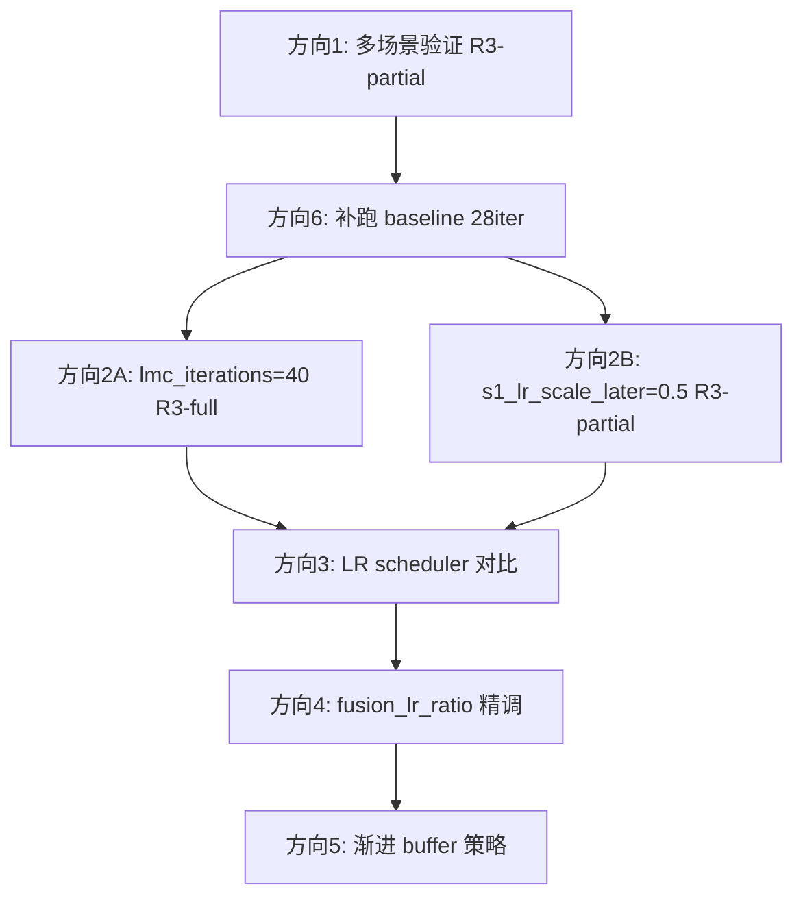

# ACE-G 下一步优化策略

## 一、当前成绩横向对比

| 实验                          | flow         | refill      | best pct5 | best pct25_5 | best median      | best iter   |
| --------------------------- | ------------ | ----------- | --------- | ------------ | ---------------- | ----------- |
| **baseline**（vanilla，无 LMC） | —            | —           | **84.6%** | 88.2%        | 1.60°/2.33cm     | iter 10     |
| flow_v1（旧 S1S2 iterative）   | iterative    | —           | 80.7%     | 83.6%        | 1.48°/2.14cm     | iter 26     |
| R1-iter-full                | iterative    | full        | 78.8%     | 81.9%        | 1.78°/2.34cm     | iter 22     |
| R1-iter-partial             | iterative    | partial     | 77.6%     | 80.4%        | 1.67°/2.29cm     | iter 17     |
| R3-aceg-r2-full             | ACE-G R2     | full        | 83.8%     | 87.6%        | 1.41°/1.98cm     | iter 26     |
| **R3-aceg-r2-partial**      | **ACE-G R2** | **partial** | **85.0%** | **88.2%**    | **1.40°/1.98cm** | **iter 19** |

**关键观察**：

- R3-partial 以 pct5=85.0% 超越 baseline，且 **median 误差更小**（1.40°/1.98cm vs 1.60°/2.33cm），说明提升是均衡的，不是单纯"easy frame"优化
- R3-partial 在 iter 19 达峰后平台，R3-full 仍在 iter 26 缓慢上升 —— 两者增益来源不同
- baseline 只跑了 10 iter 便停止，若补跑至 iter 28 可能更高，需要作为参照

## 二、下一步优化方向（优先级排序）

### 方向 1：验证 R3-partial 的提升是否稳健（必做，先行）

目前只做了 `pgt_7scenes_heads` 一个场景，存在过拟合实验配置的风险。

**实验**：用同样的 R3-partial 配置（ACE-G R2 + partial refill + `ace_g_fusion_in_s2=True`）跑至少一个额外场景（如 `chess` 或 `stairs`），验证 generalization。

- 相关脚本参考：`[scripts/run_7scenes_stairs_lmc.sh](ace_depth/scripts/run_7scenes_stairs_lmc.sh)`

---

### 方向 2：扩展 lmc_iterations，观察 R3 是否继续提升（性价比高）

R3-full 在 iter 26 仍是 BEST，曲线未收敛；R3-partial iter 19 后平台，但可能因为 compressor 在大 iter 里 LR 太低（`s1_lr_scale_later=0.2`）导致。

**实验 A**：把 `lmc_iterations` 从 28 → 40，其余配置不变，看 R3-full 是否继续提升。

**实验 B**（配合方向 3）：把 `s1_lr_scale_later` 从默认的 0.2 改为 0.5 或 1.0（mapany_flow_v1 用的值），再跑 28 iter，看 partial 的 plateau 是否能被打破。

- 关键参数：`options_dinov2_lmc.py` 中的 `--lmc_iterations`、`--s1_lr_scale_later`

---

### 方向 3：S1 LR 调度精调（compressor 更新力度）

代码中存在一个隐式降级：`lmc_lr_scheduler_type=onecycle_improved` 在 `iteration > 0` 时自动换成 `warmup_cosine`，叠加 `s1_lr_scale_later=0.2`，后期 S1 的 LR 只有首轮的 **4%（= 0.2 × warmup_cosine 峰值）**。

**实验**：对比

- `s1_lr_scale_later=0.2`（当前默认）
- `s1_lr_scale_later=0.5`
- `lmc_lr_scheduler_type=onecycle_legacy`（每轮都用 OneCycleLR，不降级）

目标：验证 compressor 的持续学习能力对最终精度的影响。

- 关键文件：`[trainer_dinov2_lmc.py](ace_depth/trainer_dinov2_lmc.py)`，`_train_compressor_steps` 的 scheduler 创建部分

---

### 方向 4：`ace_g_fusion_lr_ratio` 精调（fusion 层学习力度）

R3 目前 `ace_g_fusion_lr_ratio=0.01`，意味着 S2 中 fusion 模块用 head LR 的 1/100 做微调，非常保守。

**实验**：对比 `fusion_lr_ratio ∈ {0.01, 0.05, 0.1}`，看 S2 中适度解冻 fusion 是否带来收益，或是引起不稳定。

---

### 方向 5：渐进式 buffer 扩大策略（替代"仅最后一轮翻 3×"）

当前策略：前 27 轮 buffer=2.56M，最后一轮扩到 7.68M（`buffer_size_final`）。若最优 checkpoint 恰好在 iter 26（如 R3-full），则 best model 实际上只享受了小 buffer。

**方案**：在 `trainer_dinov2_lmc.py` 的 `_train_ace_g` / `_train_iterative` 循环里，按 `iter / total_iters` 的比例线性插值 buffer 大小，最后若干轮再用 `buffer_size_final`。

- 改动位置：`_train_ace_g` 中 `create_training_buffer` 调用前的 `buffer_size` 计算

---

### 方向 6：补全 baseline 至 28 iter（参照校准）

baseline 日志只有 10 iter，若其实际最优在 iter 10-15 之间很快收敛，则目前的对比是合理的；若它会继续提升，当前 delta 会缩小。

**操作**：重跑 baseline（无 LMC）至完整 28 iter，作为后续所有实验的 anchor。

---

## 三、建议执行顺序

方向 1、6 可并行，完成后再推进方向 2；方向 2B 的结论会直接影响方向 3 是否必要。